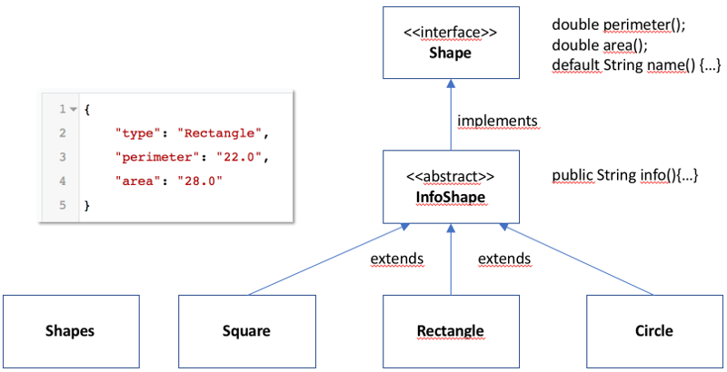

Java Programmierübung
=====================

Überblick
----------
In dieser Programmieraufgabe soll eine Art Taschenrechner für geometrische 
Objekte (Shapes) erstellt werden. Dieses Projekt gibt dabei einen Rahmen vor und im 
Folgenden wird schrittweise beschrieben, was zu tun ist. Die vorgegebenen 
Methodensignaturen dürfen nicht verändert werden, die bestehenden Interfaces 
und Klassen dürfen aber erweitert werden (z.B. zusätzliche Methoden, Konstruktoren und Attribute)
Es ist auf durchgängigen CodeStyle, gute Struktur und Übersichtlichkeit zu achten.
An sinnvollen Stellen kann JavaDoc hinzugefügt werden. 

technische Voraussetzungen:
---------------------------
- IntelliJ oder Eclipse IDE
- GIT  (optional)
- Java ab Version 10

Shape Hierarchie
----------------
Im nachfolgenden Diagramm wird die Vererbungsbeziehung von einigen Shapes
dargestellt.
Im Interface **Shape** werden die wichtigen Eigenschaften festgelegt , die alle Shapes 
gemeinsam haben. 
In der abstrakten **InfoShape** Klasse wird die *info* Methode implementiert, 
welche die im Interface festgelegten Template-Methoden(1. template) aufrufen kann um für 
alle konkreten Shapes (Circle, Rectangle usw.) einen Beschreibungs-String im 
JSON Format auszugeben. (links in der Grafik am Beispiel von **Rectangle** dargestellt) 

 (2. UML Klassendiagramm)

Aufgabenstellung:
-----------------
1. **Projektstruktur**  
Zuerst wird dieses Projekt um die nötigen Packages erweitert.

- lege im src/main/java -Ordner folgendes Base-Package an: "com.cgi.bootcamp.practice". Alle 
in diesem Projekt erstellten Klassen liegen in dem Base-Package oder in dort enthaltenen 
Unter-Packages
- erstelle das Package "shapes" innerhalb des Base-Package
- lege dieselben Packages unter "src/test/java" an.

2. **programmieren der Shapes**  
Setze die im Diagramm angegebene Klassenstruktur in JavaCode um. Nutze das "shapes"-Package für alle Klassen und Interfaces.
- Die Interfacemethoden von **Shape** sind im Diagramm neben dem Interface aufgelistet.
Beachte, daß die *name*-Methode im Interface als 'default' Methode auch implementiert wird.
Es soll der simple Klassenname als String zurückgegeben werden (also *'Circle'* für die Klasse de.cgi.bootcamp.shapes.**Circle** )
Hilfreich dafür ist eine Methode der Klasse **Class**
- InfoShape implementiert das **Shape**-Interface nur teilweise, denn es wird dort nur die _Info_-Methode implementiert. 
Unter Verwendung der Templatemethoden aus dem Interface soll ein JSON-formatierter String zurückgegeben werden, wie er am 
Beispiel **Rectangle** links im Diagramm angegeben ist. Für die Ausgabe der _Double_-Werte soll auf zwei Nachkommastellen gerundet werden.
- Die konkreten Shapes **Square**, **Rectangle** und **Circle** sollen als Datenobjekte umgesetzt werden. So sollen z.B. am Rechteck
die Attribute Länge und Breite vom Typ *double* über einen Konstruktor initialisiert werden. 
- Bei der Umsetzung von *perimeter* und *area* gibt es mehrere Alternativen, die sich in Performance, Speicherbedarf und Einfachheit unterscheiden.
Wäge ab und wähle eine Option durchgängig für alle Implementierungen. Erläutere deine Entscheidung kurz in einem Inline-Kommentar. 
- erstelle eine **Shapes** Factory mit statischen Factorymethoden (3. factory) zum Erstellen aller konkreten Shapes:  
    z.B. *public static Rectangle rectangle(double x, double y){...}*  
Es gibt mehrere Möglichkeiten, zu verhindern daß Instanzen dieser Factoryklasse angelegt werden können (4. instantiation ;) . Wähle eine Möglichkeit für die Umsetzung aus.
    
3. **Tests**  
In diesem Projekt wird absichtlich auf die Verwendung von TestFrameworks wie _TestNG_ oder _JUnit_ verzichtet, wir werden aber dennoch eine kleine Testanwendung schreiben. 

- Lege im von Dir erstellten Test-Package die Klasse **ShapeTest** an.
- Wir wollen in diesem Test die berechneten Werte von _area_ und _perimeter_ überprüfen. Dazu legen wir zuerste eine Methode an,
welche *double* Werte auf gleichheit prüft und als Ergebnis "true" zurückgibt, wenn die Werte gleich sind, ansonsten "false".  
    **private boolean checkEqual(double actual, double expected, String text)**  
- die _checkEqual_ Methode soll z.B. folgenden Text auf der Konsole ausgeben, wenn sqare.area ein falsches Ergebnis zurückliefert  
    **square(3.0).area should be 9.0 but was: 3.0**
- Für jede konkrete Shape-Klasse wird eine testmethode angelegt:  
    **public boolean testSquare(double length, double expectedArea, double expectedPerimeter)**  
Als Parameter werden alle Werte übergeben, die für die Instanziierung benötigt werden und die erwarteten Ergebniswerte.
Die Testmethode erstellt eine Instanz des konkreten **Shape**s.
Unter Verwendung der _checkEqual_ Methode soll dann die erwarteten Werte überprüft und _true_ oder im Fehlerfall _false_ zurückgegeben werden.
- Zuletzt wird eine _main_ Methode angelegt, welche alle Testmethoden der Reihe nach aufruft und die Ergebnisse zusammenfasst. Im gesamt-Erfolgsfall soll dann
"Tests SUCCEEDED" auf der Konsole ausgegeben werden, im Fehlerfall soll "Tests FAILED!" auf dem standard *error* PrintStream ausgegeben werden.

4. **Der Geometrie Rechner**  
Als nächstes soll eine ausführbare Klasse erstellt werden, welche uns eine sehr einfache Oberfläche zur Berechnung von Shapes bietet. 
Dieses Programm wird von der Kommandozeile bedient und fragt in einer Schleife einige Eingabeparameter ab um anschließend das Ergebnis 
wieder auf der Konsole auszugeben.

- Als Vorübung verschiebe bitte die Klasse *ShapeApp* aus dem 'template' Verzeichnis in das korrekte Package unter src/main/java.
- Führe die Main-Methode aus und überprüfe die Ausgabe: sind die Zahlenwerte auf maximal zwei nachkommastellen gerundet und ohne Anführungszeichen ausgegeben?
- überprüfe die Ausgabe auf dieser Webseite: <https://jsonlint.com/>, es sollte valides JSON sein.
- Erstelle nun eine eigene Klasse **GeometryCalculator** im Base-Package.
- Erstelle eine *main*-Methode, in der eine Instanz des **GeometryCalculator** erzeugt und ein kurzer Informationstext ausgegeben wird. 
Dann soll die später zu erstellende Methode _handleConsoleInOut()_ aufgerufen und eine Ende-Nachricht ausgegeben werden.
- als nächstes erstellen wir _handleConsoleInOut()_, welche in einer Schleife die Programm Ein-/Ausgaben behandelt, bis der Benutzer durch die ENTER-Taste das Programm beendet. 
- Um von der Konsole lesen zu können, benötigen wir einen **new BufferedReader(new InputStreamReader(System.in))**
- In einer Schleife lesen wir vom **BufferedReader** jeweils eine Zeile Benutzereingabe. Damit der Benutzer auch weiß, welche Befehle zur Verfügung stehen, 
soll vor jedem Durchlauf ein kurzes Menü ausgegeben werden:
    ```
    Choose your shape: (ENTER to exit)
    s: Square
    r: Rectangle
    c: Circle
    ```
- Anhand der Benutzereingabe soll mit einer _Switch_-Anweisung in spezielle Methoden verzweigt werden, in welchen die weiteren Parameter abgefragt werden, ein entsprechennden Shape angelegt und das _info_ JSON ausgeben wird.
- Danach soll wieder das Menü ausgegeben werden und erneut die Eingabe bearbeitet werden, bis der Anwender das Programm mit der _ENTER_ Taste beendet.
- Überlege, wie mit fehlerhaften Benutzereingaben umgegangen werden kann und achte auf eine benutzerfreundliche Fehlerbehandlung.

Zusatzaufgaben:
---------------
- Erweitere die Klassen so, daß in der JSON Darstellung auch die Eingabeparameter (Länge, Breite etc.) des Shapes ausgegeben werden, wie in folgendem Beispiel:
```json
{   
    "type" : "Square",  
    "perimeter" : 88.0,  
    "area" : 484.0,  
    "parameters" : {  
        "length" : "22"  
    }   
}
```

- Schreibe ein Main-Programm, welches die Liste (templates/shapes.txt) einliest und die Shapes einmal aufsteigend nach ihrer Fläche sortiert ausgibt und anschließend aufsteigend nach dem Umfang.

Links  
---------
Dir folgenden Links dienen für die Erläuterung der oben angesprochenen Konzepte:   
1. (template) <https://www.baeldung.com/java-template-method-pattern>  
2. (UML Klassendiagramm) <https://de.wikipedia.org/wiki/Klassendiagramm>
3. (factory) <https://www.baeldung.com/java-constructors-vs-static-factory-methods>
4. (instantiation ;) <http://lmgtfy.com/?q=prevent+instantiation+of+class>
5. (JSON linter) <https://jsonlint.com/>

Nachträge:
----------
Die folgenden Dinge wurden von Teilnehmern angesprochen. Ich versuche die Fragen hier zu klären, die befolgung der hier genannten Dinge hat aber keinen Einfluß auf die Bewertung.

09.09.2019
Q: Soll für 'circle' der Radius oder Durchmesser als Parameter angegeben werden?
A: Nehmt bitte, wenn möglich den Radius...


