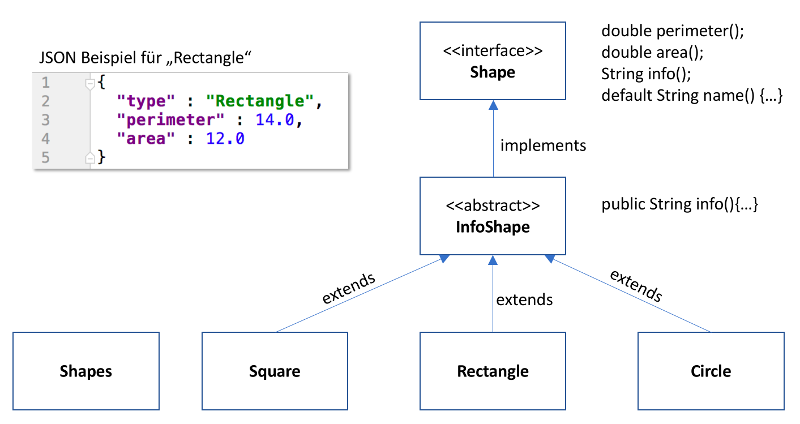

Java Programmierübung
=====================

Überblick
----------
In dieser Programmieraufgabe soll eine Art Taschenrechner für geometrische 
Objekte erstellt werden. Dieses Projekt gibt dabei einen Rahmen vor und im 
Folgenden wird schrittweise beschrieben, was zu tun ist. Die vorgegebenen 
Methodensignaturen dürfen nicht verändert werden.

technische Voraussetzungen:
---------------------------
- IntelliJ oder Eclipse IDE
- GIT  (optional)
- Java ab Version 10

Shape Hierarchie
----------------
Im nachfolgenden Diagramm wird die Vererbungsbeziehung von einigen Shapes
dargestellt.
Im Interface **Shape** werden die wichtigen Eigenschaften festgelegt , die alle Shapes 
gemeinsam haben. 
In der abstrakten **InfoShape** Klasse wird die *info* Methode implementiert, 
welche die im Interface festgelegten Template-Methoden aufrufen kann um für 
alle konkreten Shapes (Circle, Rectangle usw.) einen Beschreibungsstring im 
JSON Format auszugeben. (links in der Grafik am Beispiel von **Rectangle** dargestellt) 

